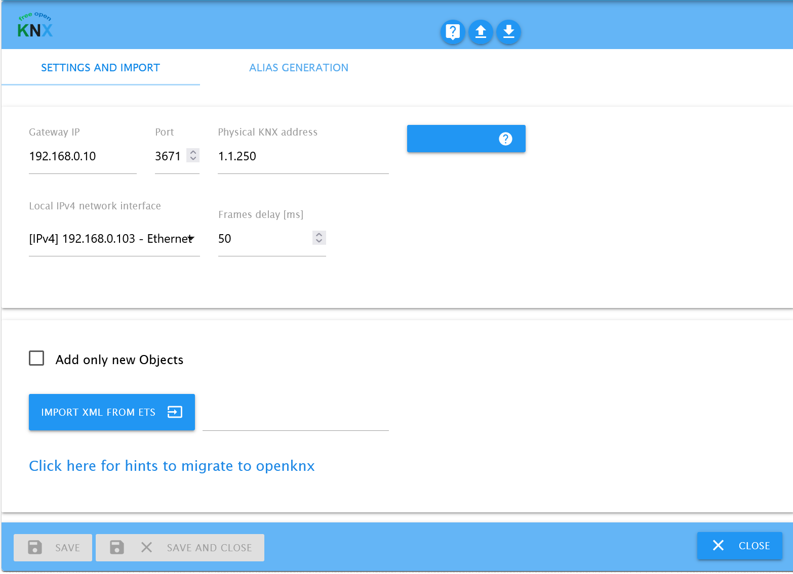
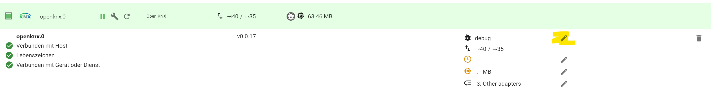

# ioBroker.openknx

This adapter serves as communication interface between Iobroker and your KNX IP Gateway.
The adapter allows to generate the iobroker communication objects automatically by importing an ETS group address xml export.  
All generated communication objects are initially configured readable and writeable, values are fetched from the knx bus on adapter restart.

# Installation
This is an early untested version. Please make a good backup of all your data before installation! Please do not test in critical environments.

install in shell

    cd /opt/iobroker/node_modules  
    npm i iobroker.openknx  
    iobroker add openknx  
    npm i knx  

updates

    npm i iobroker.openknx  
    iobroker upload openknx  

# Adapter configuration

Press "save & close" or "save" to restart the adapter and take over the changes.
When starting, the adapter tries to read all GroupAdresses with have the autoread flag (default setting).
This could take a while and can produce a higher load on your KNX-bus. This ensures that the adapter operates with up-to-date values from the start.
Autoread is done on the first connection with the knx bus after an adapter start or restart, not on every knx reconnection.  
After adapter installation, open the adapter configuration. Fill in:
#### KNX Gateway IP
IP of your KNX/Lan GW

##### Port
this is normally port 3671 of the KNX IP gateway.

##### phys. EIB Adress
Fill in physical address of the gateway in the format 1/1/1.

##### Add only new Objects
If checked, the import will skip overwriting existing communication objects.

##### Override object path
The adapter uses openknx.0 for first instance as default path for Iobroker objects.
If your curent setup has a lot of references to existing knx objects to an existing folder, then you can specify its location, for example knx.0.
This feature will be removed in future.

#### GA XML import
1. In ETS go to Group Addresses, select export group addresse and select XML export in latest format version
2. upload your ETS Export XML in the adapter via the GA XML-Import dialog
3. Import will immediatelly start after file selection and give a status report after completion.  
After the successful import a message shows how much objects where recognized. More detailed information could be found in the log.

#### Frames per sec
This settings protects the KNX bus from data flooding by limiting data frames to a certain rate. Not sent frames are put into a fifo buffer.

# howto use the adapter & basic concept
todo

# Compatibility
This adapter has its own namespace 'openknx'.
for existing applications, that are connected to knx signals of other knx adapters you can use the setting:  
Override object path  
to e.g. knx.0. A new project import will then store the data in this object tree space.
Objects are not compatible, remove them manually before the import and disable all other knx adapters.
Leave setting empty to use the adapters own namespace.

# log level
Enable expert mode to enable switching between different log levels. Default loglevel is info.  

# IOBroker Communication Object description

GA import generates a communication object folder structure following the ga main-group/middle-group scheme. Each groupaddress is an oject with following automatically generated data.

    {
    "_id": "path.and.name.to.object",                       //derieved from the KNX structure
    "type": "state",
    "common": {                                             //values here can be interpreted by iobroker
        "desc": "Basetype: 1-bit value, Subtype: switch",   //informative, from dpt
        "min": 0,                                           //derieved from dpt
        "max": 1,                                           //derieved from dpt
        "name": "Aussen Melder Licht schalten",             //informative description from ets export
        "read": true,                                       //default set, if false incoming bus values are not updating the object
        "role": "",                                         //tbd
        "type": "boolean",                                  //boolean, number, string, object, derieved from dpt
        "unit": "",                                         //derived from dpt
        "write": true                                       //default true, if set change on object is triggering knx write, succ. write sets then ack flag to true
    },
    "native": {                                             //values here can be interpreted by openknx adapter
        "address": "0/0/7",                                 //knx address
        "answer_groupValueResponse": false,                 //default false, if set to true adapter responds with value on GroupValue_Read
        "autoread": true,                                   //default true, adapter sends a GroupValue_read on start to sync its states
        "bitlength": 1,                                     //size ob knx data, derived from dpt
        "dpt": "DPT1.001",                                  //DPT
        "encoding": {                                       //informative
        "0": "Off",
        "1": "On"
        },
        "force_encoding": "",                               //informative
        "signedness": "",                                   //informative
        "valuetype": "basic"                                //composite means set via a specific javascript object
    },
    "from": "system.adapter.openknx.0",
    "user": "system.user.admin",
    "ts": 1638913951639
    }

# Adapter communication Interface Description
Handeled DPTs are: 1-21,232,237,238  
Unhandeled DPTs are written as raw buffers, the interface is a sequencial string of hexadecimal numbers. For example write '0102feff' to send values 0x01 0x02 0xfe 0xff on the bus. 
Where number datatype is used please note that interface values can be scaled.

#### API call

    setState(
        id: string,                                     // object path
        state: State | StateValue | SettableState,
        ack: false,                                     //set to false and will be set to true by KNX stack on send confirmation
        c: 'GroupValue_Read'                            //optional comment, set this value to trigger a bus read to this object, given StateValue is ignored
    ): void;

#### Description of all DPTs

|KNX DPT        |javascript datatype                	        |special values	|value range |
|---        |---        |---                                    |---|
|DPT-1	    |boolean    |                                    |false, true|
|DPT-2	    |object	    |{"priority":1 bit,"data":1 bit}	       |-|
|DPT-3	    |object	    |{"decr_incr":1 bit,"data":2 bit}	|-|
|DPT-18	    |object	    |{"save_recall":0,"scenenumber":0}	|
|DPT-21	    |object	    |{"outofservice":0,"fault":0,"overridden":0,"inalarm":0,"alarmunack":0}	|-|
|DPT-232	|object	    |{red:0..255, green:0.255, blue:0.255}	-|
|DPT-237	|object	    |{"address":0,"addresstype":0,"readresponse":0,"lampfailure":0,"ballastfailure":0,"convertorerror":0}	|-|
|DPT-4	    |string		||one character sent as 8-bit character|
|DPT-16	    |string		||one character sent as 16-character string|
|DPT-5	    |number		||8-bit unsigned value|
|DPT-5.001	|number		||0..100 [%] scaled to 1-byte|
|DPT-5.003	|number		||0..360 [°] scaled to 1-byte|
|DPT-6	    |number		||8-bit signed -128..127|
|DPT-7	    |number		||16-bit unsigned value|
|DPT-8	    |number		||2-byte signed value |-32768..32767|
|DPT-9	    |number		||2-byte floating point value|
|DPT-14	    |number		||4-byte floating point value|
|DPT-12	    |number		||4-byte unsigned value|
|DPT-13	    |number		||4-byte signed value|
|DPT-15	    |number		||4-byte|
|DPT-17	    |number		||1-byte|
|DPT-20	    |number		||1-byte|
|DPT-238 	|number		|                         |1-byte|
|DPT-10	    |number for Date Object		||-|
|DPT-11	    |number for Date Object		||-|
|DPT-19	    |number for Date Object		||-|
|rest	    |string	    |00010203..	            |-|

Only time and date information is exchanged with KNX time based datatypes, e.g. DPT-19 has unsupported fields for signal quality  

Object send and receive values are of type boolean DPT1), number (scaled, or unscaled), string.  
DPT 2 'expects a object {"priority":0,"data":1}' receive provides a strinified object of same type.  
Other joint DPTs have similar object notation.  
DPT19 expects a Number from a Date Object, Iobroker can not handle objects, fields of KNX ko that cannot be derived from timestamp are not implemented eg. quality flags

Date and time DPTs (DPT10, DPT11)  
Please have in mind that Javascript and KNX have very different base type for time and date. 
DPT10 is time (hh:mm:ss) plus "day of week". This concept is unavailable in JS, so you'll be getting/setting a regular Date Js object, but please remember you'll need to ignore the date, month and year. The exact same datagram that converts to "Mon, Jul 1st 12:34:56", will evaluate to a wildly different JS Date of "Mon, Jul 8th 12:34:56" one week later. Be warned! 
DPT11 is date (dd/mm/yyyy): the same applies for DPT11, you'll need to ignore the time part.

#### group value write
send is triggered by writing a communication object.
Communication object is triggered when a write frame is received on the bus.

#### group value read
Sending can be triggered by writing a communicaton object with comment.
Receiving, if configured will trigger a group value response (limitation: write) of the actual c.o. value, see below

#### group value response
Sending Not yet supported. Emulated if response setting is set and adapter writes a group value write.
Receiving will update the value of the iobroker object in read is set to true.

# Features
* fast import of groupaddresses in XML format
* stable knx stack
* interpretation of many DPTs
* raw read and write of unsupported DPTs
* support of group value read and group value write, group value write as response to group value request
* Autoread
* free open source

# Known Problems
- sends write instead of GroupValue_Response on GroupValue_Read
- IOBroker object role definition missing

# Limitations
- only three level group addresses are supported

## Changelog
### 0.1.2
* initial test release

### 0.0.19
* display warning on ga import file errors

### 0.0.17
* raw value handling, can now write and receive ga of unsupported dpt
* setting onlyAddNewObjects fixed
* adapter restart after import

### 0.0.14
* import ga xml
